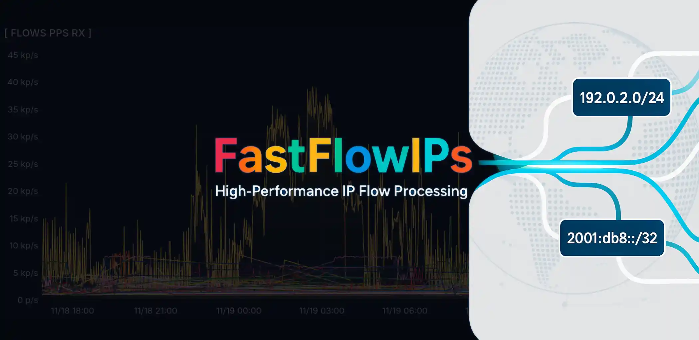

# FastFlowIPs

[](./LICENSE)
[](https://golang.org)
[](https://ebpf.io)
[](https://kernel.org)
[](https://github.com)
[](./Makefile)
[](./SUMMARY.md)

High-performance eBPF network monitoring tool that tracks per-IP traffic statistics in real-time. Built for production environments with minimal overhead.

## What it does

Captures network traffic using eBPF, calculates per-IP statistics (PPS, Mbps) for both IPv4 and IPv6, and can automatically ban IPs exceeding thresholds. Exports metrics to Graphite for monitoring dashboards.

## Quick start

```bash
# Build
make

# Monitor with stats display
sudo ./fastflowips -show-stats

# Silent monitoring with IP banning
sudo ./fastflowips -ban-pps-rx 1000 -ban-script ./ban.sh

# Export to Graphite
sudo ./fastflowips -graphite-host localhost -show-stats

# Install as system service
sudo ./fastflowips -install -interface eth0
```

Requires root for eBPF attachment.

## Key features

**Performance**: Optimized for high-traffic networks. 75% fewer mutex operations, 60% faster string processing than typical implementations.

**Flexible monitoring**: Track specific networks with `-networks "10.0.0.0/8 2001:db8::/32"` (IPv4 and IPv6) or monitor everything.

**Smart filtering**: Only export meaningful metrics to Graphite with `-min-flow-pps` and `-min-ips-pps`.

**Production ready**: Install as systemd service with auto-restart and logging. Automatically re-attaches eBPF programs when the monitored interface restarts (e.g. after VyOS/router config commits).

**Automatic banning**: Set thresholds for PPS/Mbps and execute custom scripts when exceeded.

## Configuration

```bash
# Interface and basics
-interface eth0              # Network interface (default: eth0)
-interval 5s                 # Collection interval
-show-stats                  # Display periodic tables
-verbose                     # Detailed logging

# Network filtering
-networks "192.168.1.0/24 10.0.0.0/8 2001:db8::/32"  # Space-separated CIDRs, IPv4 + IPv6

# IP banning thresholds
-ban-pps-rx 1000            # Ban if receiving > 1000 PPS
-ban-pps-tx 500             # Ban if sending > 500 PPS
-ban-mbps-rx 100            # Ban if receiving > 100 Mbps
-ban-mbps-tx 50             # Ban if sending > 50 Mbps
-ban-time 5m                # How long to ban
-ban-script /path/script.sh  # Script to execute on ban/unban

# Graphite export
-graphite-host localhost     # Graphite server
-min-flow-pps 10            # Only export flows > 10 PPS
-min-ips-pps 5              # Only export IPs > 5 PPS
```

## Monitoring modes

**Silent** (default): Only shows bans and startup messages. Perfect for production.

**Stats** (`-show-stats`): Displays periodic traffic tables sorted by volume.

**Verbose** (`-verbose`): Detailed logging including Graphite export statistics.

## Ban script

When thresholds are exceeded, your script gets called:

```bash
/path/to/script.sh ban 192.168.1.100    # IPv4 exceeded threshold
/path/to/script.sh unban 192.168.1.100  # Ban expired
/path/to/script.sh ban 2001:db8::1      # IPv6 is passed the same way
```

The IP can be IPv4 or IPv6, so the script should handle both:

```bash
#!/bin/bash
ipt=iptables
[[ $2 == *:* ]] && ipt=ip6tables
case $1 in
  ban)   $ipt -I INPUT -s $2 -j DROP ;;
  unban) $ipt -D INPUT -s $2 -j DROP 2>/dev/null ;;
esac
```

## Graphite metrics

Flow metrics: `network.flows.{SRC_IP}_to_{DST_IP}.{pps,mbps}.{rx,tx}`
IP metrics: `network.ips.{IP_ADDRESS}.{pps,mbps}.{rx,tx}`

Address separators are sanitized to `_` (`.` for IPv4, `:` for IPv6), e.g. `2001:db8::1` → `2001_db8__1`.

Use filtering (`-min-*`) to avoid noise from low-traffic flows.

## Service installation

Install as systemd service for automatic startup:

```bash
sudo ./fastflowips -install -interface eth0 -graphite-host localhost

# Manage service
systemctl status fastflowips
journalctl -u fastflowips -f
```

## Performance tips

- Use `-networks` to monitor only relevant subnets
- Set `-min-flow-pps` and `-min-ips-pps` to filter noise
- Increase `-ip-cache-size` for high-traffic environments
- Monitor with `-verbose` initially, then switch to silent mode

## Requirements

Linux with eBPF support, root privileges, Go compiler, clang for eBPF compilation.

Built and tested on production networks handling thousands of flows per second.

## License

FastFlowIPS is released under the **FastFlowIPS License**.  
- ✅ Free for non-commercial and community use
- 🚫 Commercial use requires a separate license, please contact the author  
See the [LICENSE](./LICENSE) file for details.
